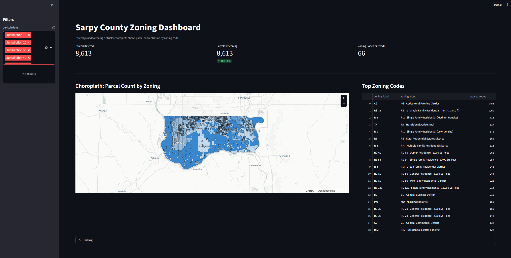
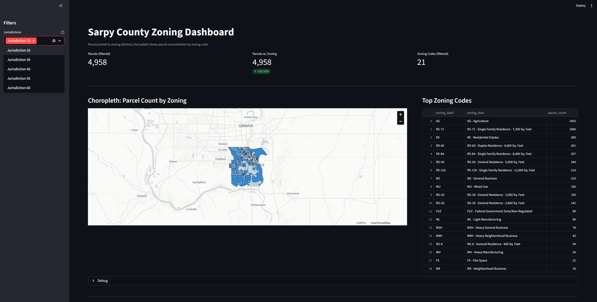
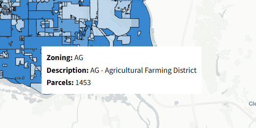

\# NuMetriq - Sarpy County Zoning Parcel Dashboard


A reproducible GIS analytics pipeline and interactive dashboard that shows how parcels are distributed across zoning districts within Sarpy County, Nebraska and its municipalities.

This project uses publicly available ArcGIS GIS data published by Sarpy County to demonstrate an end-to-end workflow: ingestion, validation, spatial joins, geometry repair, aggregation, and visualization.

**Build by NuMetriq LLC** using publicly available Sarpy County GIS data.


\## Project Purpose

Local governments maintain rich GIS datasets, but answering even basic structural questions—such as “How many parcels are governed by each zoning designation?”—often requires significant manual GIS work.

This project provides:

\- a clean, auditable parcel-to-zoning assignment

\- jurisdiction-aware aggregation

\- an interactive map and summary table suitable for planning, reporting, and exploratory analysis

The goal is to demonstrate how public GIS data can be transformed into **decision-ready operational insight** using transparent, reproducible, open-source tooling.


\## What the Dashboard Shows

\### Zoning districts, colored by parcel concentration

\- Each polygon represents a zoning district, not individual parcels.

\- Color intensity reflects the number of parcels primarily governed by that zoning code.

\- Darker areas indicate zoning categories that affect more parcels.

\### Deduplicated, authoritative parcel counts

\- Parcels are spatially joined to zoning polygons.

\- Parcels overlapping multiple zoning districts are assigned to the district with the largest area of overlap.

\- Each parcel is counted once and only once.

This avoids double-counting and reflects the dominant zoning assignment for each parcel.

\### Jurisdiction-based filtering

Users can filter by jurisdiction (e.g., Bellevue, Papillion, La Vista)

When a jurisdiction is selected:

\- Zoning polygons are filtered first

\- Parcels are filtered to relevant zoning codes

\- Counts, colors, and summaries update consistently

This ensures that parcel counts and zoning geometry remain internally consistent within each selected jurisdiction.

\### Tabular summary

A ranked table shows:

\- zoning code

\- zoning description

\- parcel count

This supports reporting, exporting, and downstream analysis.


\## Methodology at a Glance

\1. Ingest public parcel and zoning layers from Sarpy County ArcGIS REST services  
\2. Normalize geometries and enforce a common CRS  
\3. Spatially join parcels to zoning polygons  
\4. Resolve multi-zoning overlaps using dominant area assignment  
\5. Aggregate parcel counts by zoning code and jurisdiction  
\6. Visualize results in an interactive Streamlit dashboard


\## What This Dashboard Does *Not* Do (by design)

\- ❌ It does not evaluate zoning policy quality or compliance

\- ❌ It does not show land value, land use, or population

\- ❌ It does not replace detailed parcel-level GIS workflows

It answers a structural inventory question, not a normative policy question.


\## Example use cases

\- Understanding which zoning categories affect the most properties

\- Scoping the impact of zoning code updates

\- Planning staff workload estimation

\- Sanity-checking zoning datasets against parcel reality

\- Preparing inputs for deeper land-use or housing analysis


\## Data Sources

All data used in this project is publicly available.

\- Sarpy County GIS - Tax Parcels

\- Sarpy County GIS - Zoning Districts

\- ArcGIS REST services published by Sarpy County

No proprietary or restricted data is used.


\## Technical Overview

\### Tech Stack

\- Python

\- GeoPandas / Shapely

\- Pandas

\- Streamlit

\- PyDeck (deck.gl)

\- ArcGIS REST API

\### Key design decisions

\- Local projected CRS (UTM14N) is used for all area calculations to ensure geometric correctness.

\- Geometry repair (`make_valid`, `buffer(0)`) is applied defensively to prevent topology errors.

\- Aggregations are driven from parcel-level truth, not polygon overlaps.

\- The app is configuration-driven (e.g., jurisdiction labels via `.env`).


\## Repository Structure

bellevue-sarpy-gis-ops-dashboard/
├── data/
│   ├── raw/                # Raw GeoJSON pulled from ArcGIS
│   └── processed/          # Cleaned Parquet datasets
├── scripts/
│   ├── 01_ingest_*.py      # Data ingestion from ArcGIS REST
│   ├── 02_build_processed.py
│   ├── 04_build_spatial_joins.py
│   ├── 05_dedup_parcels_with_zoning.py
│   ├── 07_build_zoning_dissolve.py
│   └── 09_audit_arcgis_layer_fields.py
├── src/
│   └── opsdash/
│       └── app/
│           └── streamlit_app.py
├── .env.example
├── README.md
└── pyproject.toml

Raw and processed GIS datasets are intentionally excluded from version control and are fully reproducible using the included ingestion scripts and public ArcGIS REST services.


\## Setup & Running the Dashboard

\### 1) Clone the repository

```bash

git clone https://github.com/NuMetriq/sarpy-zoning-parcel-dashboard.git
cd sarpy-zoning-parcel-dashboard

```

\### 2) Create and activate a virtual environment

```bash

python -m venv .venv

.venv\Scripts\activate #Windows

```

\### 3) Install dependencies

```bash

pip install .

```

\### 4) Configure environment variables

Copy the example file:

```bash

cp .env.example .env

```

Edit `.env` to include jurisdiction labels:

```ini

JURISDICTION_LABELS=10:Bellevue,20:Gretna,30:La Vista,40:Papillion,50:Springfield,60:Unincorporated

```

\### 5) Run the pipeline

```bash

python scripts/01_ingest_all.py
python scripts/02_build_processed.py
python scripts/04_build_spatial_joins.py
python scripts/05_dedup_parcels_with_zoning.py
python scripts/07_build_zoning_dissolve.py

```

\### 6) Launch the dashboard

```bash

streamlit run src/opsdash/app/streamlit_app.py

```


\## Dashboard Preview

\### Zoning distribution (all jurisdictions)


\### Bellevue zoning distribution


\### Zoning tooltip detail



\## Data Integrity Notes

\- Parcel counts are computed from `parcels_with_zoning_1to1.parquet`

\- Zoning polygons are dissolved after filtering, not before

\- Invalid geometries are repaired prior to union operations

\- Empty or invalid user selections are handled gracefully


\## Future Enhancements

Potential next steps include:

\- parcel-area-weighted zoning analysis

\- Bellevue-only default view

\- exportable CSV and GeoJSON outputs

\- historical zoning change tracking

\- land-use or housing overlays


\## About This Project

This project was built to demonstrate:

\- applied GIS engineering

\- data quality handling

\- spatial reasoning

\- reproducible analytics workflows

\- practical local-government use cases

It is intentionally scoped to be useful, transparent, and extensible, rather than a toy visualization.


\## About NuMetriq

NuMetriq LLC builds transparent, reproducible analytics tools that help public-sector and SMB organizations turn complex data into clear operational insight.

Our work emphasizes:
\- data quality and validation
\- spatial and operational analytics
\- auditable, decision-support workflows

This project was developed independently using public data and is intended to demonstrate NuMetriq’s approach to applied analytics in a local-government context.
